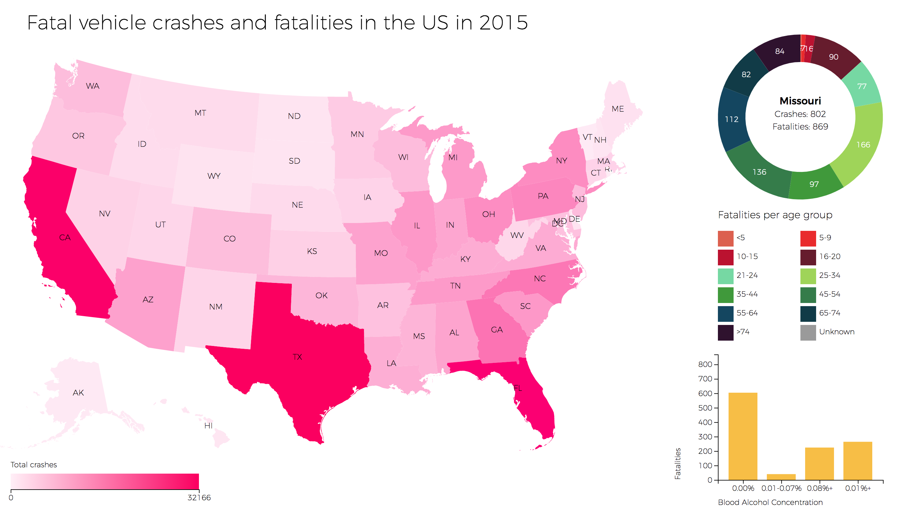

# Assessment 3



For Assessment 3 I created a visualisation that shows the number of fatal vehicle crashes and fatalities in the United States in 2015. The data was taken from the website of the [National Highway Traffic Safety Administration](https://www-fars.nhtsa.dot.gov) and has been cleaned by me.

## Background:
The idea I had behind this visualisation was to show the number of fatal vehicle crashes per state and compare them with the number of fatalities, their age group and the alcohol concentration in their blood. I wanted to combine these types of data, because I believe these have a connection and are interesting to compare.
I also wanted to compare different states and how each relate to the entire country instead of just showing the total numbers.

The result is an interactive map of the United States. By clicking on each state, you can view the number of people per age group and the alcohol concentration in their blood. You can compare the number of fatal crashes and the number of fatalities per state and can easily compare different states together as the numbers are updated instantly.

## Data:

The following is a snippet from the cleaned data set:

```
{stateAbbreviation: "AL", state: "Alabama", totalCrashes: 783, crashes: Array(7), totalFatalities: 849, …}
{stateAbbreviation: "AK", state: "Alaska", totalCrashes: 60, crashes: Array(7), totalFatalities: 65, …}
{stateAbbreviation: "AZ", state: "Arizona", totalCrashes: 810, crashes: Array(7), totalFatalities: 893, …}
{stateAbbreviation: "AR", state: "Arkansas", totalCrashes: 472, crashes: Array(7), totalFatalities: 531, …}
```

After cleaning, I formatted the dataset into a CSV format, by using a map function that looked something like this:

```
function map1 (d) {
	return {
		'stateAbbreviation': stateAbbreviations[d[0]],
		'state': d[0],
		'totalFatalities': Number(d[13]),
		'fatalities': [
			{
				'age': '<5',
				'value': Number(d[1])
			},
			{
				'age': '5-9',
				'value': Number(d[2])
			},
			{
				'age': '10-15',
				'value': Number(d[3])
			}
		]
	}
}
```

In this example the dataset displays the following things:

* State abbreviation ('AL' for Alabama): rewriting the state names as their abbreviations
* State: the name of the state as given by the data file
* Total fatalities: the total number of fatalities of that state, parsed as a number
* Fatalities: an array of different age groups, using the key `'age'` and the value as given by the data file, parsed as a number

## Cleaning the data:
The data was taken from the website of the [National Highway Traffic Safety Administration](https://www-fars.nhtsa.dot.gov). Since every chart on the website had to be downloaded seperatly, I created 3 data files. I downloaded each chart that was useful to me and stored them as seperate .txt files. All of them had the same format. The files always started with a header, specifying the different columns. A typical header looked something like this:

```
    First Harmful Event	                              
    Collision With	              Non-Collision	              
    Motor Vehicle	  Nonmotorist	  Fixed Object	  Object Not Fixed	  Overturn	  Other	  Unknown	  Total Fatal Crashes	  
State	Number	Percent	Number	Percent	Number	Percent	Number	Percent	Number	Percent	Number	Percent	Number	Percent	Number	Percent	
```

Also, since these data files showed the states, each dataset always started with the first state in alphabetical order: Alabama. Therefore it was really easy to remove the header:

```
var header = doc[i].indexOf('Alabama');
doc[i] = doc[i].slice(header).trim();
```

After removing the header, the only thing left was the data itself, seperated by tabs. The only thing left to do was to change these tabs into commas:

`doc[i] = doc[i].replace(/\t/g, ',');`

And now the data files have been cleaned.

## Interaction:

You can interact with the visualisation by clicking on a state. After doing this, the data belonging to that state will be displayed in the donut and bar charts next to the map, as these charts will begin to change it's data. If you want to find out exactly what the numbers in the bar chart are, you can hover over one to view the number displayed in a tooltip.

## Changes:

In order to create the arcs for the donut chart, I used this piece of code from an example and changed the values for the outerRadius and innerRadius to meet my desires.

```
var arc = d3.arc()
	.outerRadius(radius)
	.innerRadius(radius / 1.5);
```

Also, I used this piece of code to create the donut chart. The only thing I changed here was the d.value:

```
var pie = d3.pie()
	.sort(null)
	.value(function (d) { return d.value; });
```

In order to load multiple data files simultaneously, I used this piece of code and changed the imported files:

```
d3.queue()
	.defer(d3.json, 'https://d3js.org/us-10m.v1.json')
	.defer(d3.text, 'dataset0.txt')
	.defer(d3.text, 'dataset1.txt')
	.defer(d3.text, 'dataset2.txt')
	.await(function (err, us, doc0, doc1, doc2) {
		if (err) throw err;
		onload(us, [doc0, doc1, doc2]);
	});
```

I used this piece of code in order to add multiple objects together. I found this solution on the internet and changed the data variables that needed to be combined:

```
data0.forEach(function (item, i) {
	Object.assign(item, data1[i], data2[i]);
});
```

## Features:

### D3 Features:

* [d3.geoPath](https://github.com/d3/d3-geo/blob/master/README.md#geoPath) `var path = d3.geoPath();`
* [d3.scaleLinear](https://github.com/d3/d3-scale/blob/master/README.md#scaleLinear) `var colorsMap = d3.scaleLinear()`
* [d3.scaleOrdinal](https://github.com/d3/d3-scale/blob/master/README.md#scaleOrdinal) `var xMap = d3.scaleOrdinal()`
* [d3.axisBottom](https://github.com/d3/d3-axis/blob/master/README.md#axisBottom) `var xAxisMap = d3.axisBottom(xMap);`
* [d3.arc](https://github.com/d3/d3-shape/blob/master/README.md#arc) `var arc = d3.arc()`
* [d3.pie](https://github.com/d3/d3-shape/blob/master/README.md#pie) `var pie = d3.pie()`
* [d3.scaleBand](https://github.com/d3/d3-scale/blob/master/README.md#scaleBand) `var xBar = d3.scaleBand()`
* [d3.axisLeft](https://github.com/d3/d3-axis/blob/master/README.md#axisLeft) `var yAxisBar = d3.axisLeft(yBar);`
* [d3.queue](https://github.com/d3/d3-queue/blob/master/README.md#queue) `d3.queue()`
* [d3.csvParseRows](https://github.com/d3/d3-dsv/blob/master/README.md#csvParseRows) `var data0 = d3.csvParseRows(doc[0], map0);`
* [d3.max](https://github.com/d3/d3-array/blob/master/README.md#max) `d3.max(data, function (d) { if (d.state !== 'USA') return d.totalCrashes; })`
* [d3.interpolate](https://github.com/d3/d3-interpolate/blob/master/README.md#interpolate) `var i = d3.interpolate(this._current, a);`

### Features humans can understand:

* Interactive map of the United States
* Displaying the number of fatal vehicle crashes per state
* Showing additional information per state when you click on one
* Displaying the total number of fatalities per state
* Displaying the number of fatalities per state per age group
* Displaying the number of fatalities per state and the alcohol percentage in their blood

## License:

**Choropleth inspiration taken from:** Mike Bostock. GNU General Public License, version 3.
**Donut chart inspiration taken from:** Mike Bostock. GNU General Public License, version 3.
**Bar chart inspiration taken from:** Justin Palmer.
**Dataset taken from:** the [National Highway Traffic Safety Administration](https://www-fars.nhtsa.dot.gov).

&copy; Max de Vries 2017
